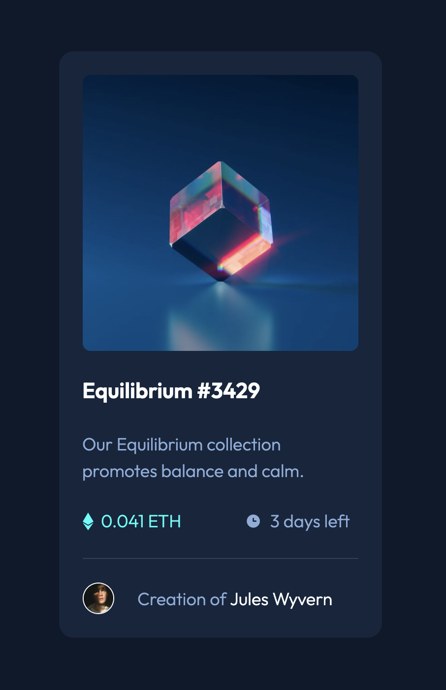

# Frontend Mentor - NFT preview card component solution

This is a solution to the [NFT preview card component challenge on Frontend Mentor](https://www.frontendmentor.io/challenges/nft-preview-card-component-SbdUL_w0U). Frontend Mentor challenges help you improve your coding skills by building realistic projects.

## Table of contents

- [Overview](#overview)
  - [The challenge](#the-challenge)
  - [Screenshot](#screenshot)
  - [Links](#links)
- [My process](#my-process)
  - [Built with](#built-with)
- [Author](#author)

**Note: Delete this note and update the table of contents based on what sections you keep.**

## Overview

### The challenge

Users should be able to:

- View the optimal layout depending on their device's screen size
- See hover states for interactive elements

---

### Screenshot

Screenshot of the application

---

### Links

- Solution URL: [Add solution URL here](https://your-solution-url.com)
- Live Site URL: [Add live site URL here](https://your-live-site-url.com)

---

## My process

I normally get stuck in to these challenges with frontend frameworks and/or CSS preprocessors or frameworks. For this challenge I decided to just use pure CSS and HTML, since recently I feel I have really been ignoring basic HTML/CSS principles and I don't want to lose sight of my fundamentals. So... here's a bare-bones project! I coded this up in the latter half of an afternoon and would like to revisit it after getting some feedback on my semantic HTML and CSS styles.

---

### Built with

- Semantic HTML5 markup
- Pure CSS3
- Flexbox
- CSS Grid
- Mobile-first workflow

---

## Author

- Frontend Mentor - [@james-work-account](https://www.frontendmentor.io/profile/james-work-account)
- Check out my band! - [Laguna's Dream](https://www.lagunasdream.co.uk)
